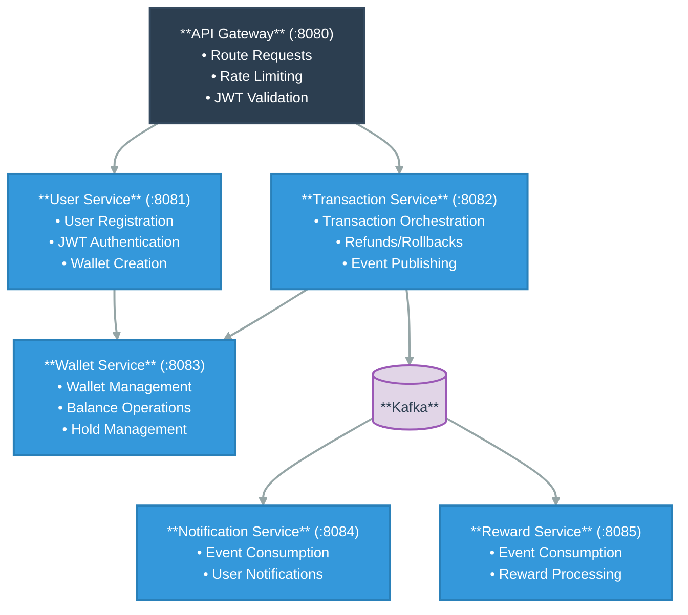

# 💳 PayFlow – Digital Payment System


## 📋 Table of Contents

* [Overview](#overview)
* [System Architecture](#system-architecture)
* [Microservice Implementation Overview](#microservice-implementation-overview)
* [Technology Stack](#technology-stack)
* [Project Setup](#project-setup)


## 🎯 Overview <a name="overview"></a>

**PayFlow** is a **PayPal-like digital payment system** built using **Java and Spring Boot microservices**, designed to simulate how real-world payment platforms handle secure money transfers. The system allows users to send and receive money through wallets while ensuring **data consistency, fault tolerance, and high reliability**.

It follows an **event-driven microservices architecture** and implements real financial concepts such as **authorization holds, balance locking, scheduled hold expiry, and compensating transactions** to safely handle failures. Payments are processed step-by-step with clear rollback mechanisms, while asynchronous services handle notifications and rewards without impacting transaction performance.

The project focuses on **practical backend engineering**, demonstrating how distributed systems manage concurrency, failures, and scalability in payment workflows.

---

## 🏗 System Architecture <a name="system-architecture"></a>



---

## 🔧 Microservice Implementation Overview <a name="microservice-implementation-overview"></a>

### 🔐 API Gateway (Port 8080)

Acts as the **single entry point** for all client requests, enforcing cross-cutting concerns centrally.

* Routes requests to appropriate downstream microservices
* Performs **JWT validation** before forwarding secured requests
* Implements **Redis-based distributed rate limiting** to prevent abuse
* Maintains a unified security layer across the system
* Separates public and protected routes for authentication flows

---

### 👤 User Service (Port 8081)

Handles **user lifecycle management** and authentication workflows.

* User registration and login with **JWT token issuance**
* Secure password encryption using Spring Security
* Automatically provisions a wallet by invoking Wallet Service during user registration
* Uses **Feign Client** for inter-service communication
* Ensures transactional integrity by rolling back user creation if wallet creation fails
* Manages user profiles and authentication metadata

---

### 💰 Transaction Service (Port 8082)

The **core payment orchestration engine** responsible for executing money transfers.

**Transaction Processing Flow (Real-World Financial Pattern):**

1. Create transaction with `PENDING` status
2. Place authorization hold on sender’s wallet
3. Validate receiver wallet existence
4. Capture the hold to debit sender funds
5. Credit receiver wallet
6. Mark transaction as `SUCCESS` or `FAILED`
7. Publish transaction events to Kafka
8. Trigger **compensating actions** (hold release / refund) on any failure

**Key Implementation Concepts:**

* Hold–Capture–Release pattern
* Idempotent transaction handling to safely manage retries
* Detailed transaction audit trail
* Kafka event publishing for asynchronous downstream processing

---

### 💼 Wallet Service (Port 8083)

Manages **wallet balances and monetary state** with strong consistency guarantees.

* Wallet creation and lifecycle management
* Credit and debit operations
* Authorization hold placement reducing available balance
* Hold capture converting reserved funds into actual debit
* Hold release to rollback failed transactions
* Uses **pessimistic database locking** to prevent race conditions
* Scheduled jobs for automatic expiry of stale holds
* Maintains audit history for all wallet operations

**Hold States:**

* `ACTIVE` – funds reserved
* `CAPTURED` – funds deducted
* `RELEASED` – funds returned

---

### 🔔 Notification Service (Port 8084)

Implements **asynchronous, non-blocking user notifications**.

* Consumes transaction events from Kafka
* Generates notifications for senders and receivers
* Stores notification history and delivery status
* Decoupled from transaction execution to improve performance and reliability


---

### 🎁 Reward Service (Port 8085)

Handles **reward point allocation**.

* Consumes successful transaction events from Kafka
* Calculates and assigns reward points to users
* Ensures **idempotency** using transaction IDs to prevent duplicate rewards
* Maintains reward history and balances
* Fully asynchronous to avoid impacting core payment flow

---

## 🛠 Technology Stack <a name="technology-stack"></a>

[](https://openjdk.java.net/)
[](https://spring.io/projects/spring-boot)
[](https://microservices.io/)
[](https://www.docker.com/)
[](https://kafka.apache.org/)

### Backend & Frameworks

* Java 21
* Spring Boot 3.5.8
* Spring Cloud Gateway
* Spring Security
* Spring Data JPA
* Spring Kafka

### Databases & Caching

* PostgreSQL 16
* Redis (rate limiting)

### Messaging

* Apache Kafka
* Zookeeper

### Security

* JWT (JJWT)

### Inter-Service Communication

* OpenFeign
* RestTemplate

### Build & DevOps

* Docker & Docker Compose
* Maven
* Lombok
* Jackson
* Hibernate Validator

---

## 🚀 Project Setup  <a name="project-setup"></a>

### Prerequisites

* Java 21
* Docker & Docker Compose
* Maven (optional)

### Steps

```bash
git clone <repository-url>
cd backend
cp .env_example .env
docker-compose up --build
```

### Verify services:

```bash
docker-compose ps
docker-compose logs -f <service-name>
```

The system is accessible via **API Gateway** at:
`http://localhost:8080`

---

